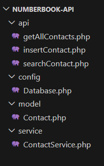
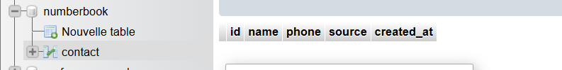
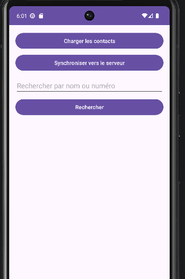
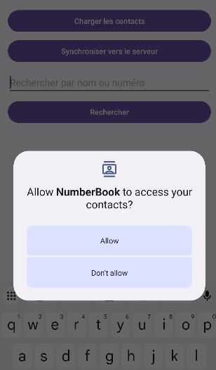

# NumberBook - Système de Synchronisation de Contacts

Ce projet est une application Android de gestion de contacts connectée à une base de données MySQL distante via une API PHP sécurisée (utilisant l'architecture PDO).

## Architecture du Projet

L'organisation du projet suit une architecture modulaire pour séparer la logique métier de l'accès aux données.

**Structure du Backend (XAMPP) :**
- `config/` : Connexion à la base de données.
- `model/` : Définition de l'objet Contact.
- `service/` : Logique de traitement des données.
- `api/` : Points d'entrée pour l'application mobile.

---

## Tests & Validation

Voici les étapes de validation effectuées pour s'assurer du bon fonctionnement du système :

Validation de la structure de stockage sous phpMyAdmin.

Lancement de l"application et validation du fonctionnement.

